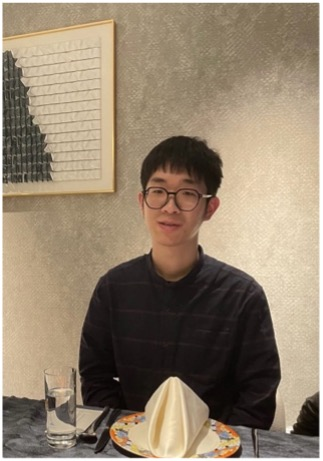

**报告摘要**: 确保复杂并发系统从抽象模型到实现代码的精化过程中始终保持信息流安全性质，是构建高等级可信系统的核心挑战之一。本报告将分享发表于 CCS '25 的研究成果：一种通用的并发系统信息流安全精化验证框架。该框架通过依赖-保证组合验证技术有效处理了线程间的复杂交互，支持包括受控信息泄漏在内的多种安全策略，并已在 ARINC 653 航空操作系统等工业级案例中通过 Isabelle/HOL 进行形式化验证。报告最后将探讨信息流安全理论在 AI 智能体安全领域的新机遇。针对智能体在自主调用工具时面临的间接提示词注入等新兴风险，讨论如何借鉴污点追踪与非干扰性原则，为下一代智能体构建具备逻辑透明度与强鲁棒性的安全监控机制。

**报告人简介**: 孙欢，上海人工智能实验室青年研究员，2025年获浙江大学控制科学与工程博士学位，师从王竟亦研究员与王文海教授。研究方向涵盖程序逻辑、定理证明、并发程序验证与信息流安全等，相关成果发表于CCS、ICFEM软件学报等国际国内会议期刊，并已申请多项发明专利。

<!--more-->
