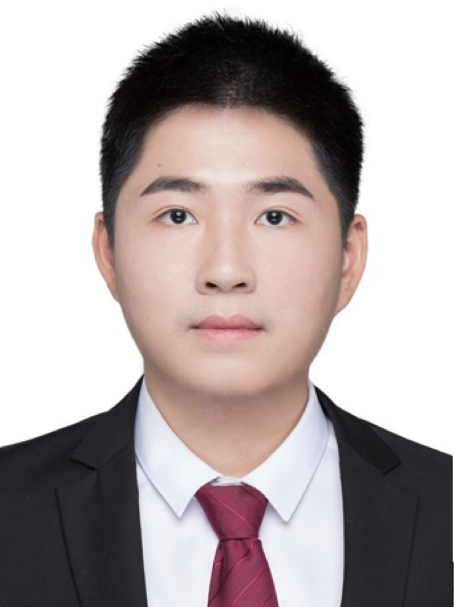

**报告摘要**: 随着大语言模型在代码理解与生成任务中的快速发展，程序规约合成正成为提升软件正确性、可靠性的重要技术路径。然而，现有研究多依赖简化后的小型基准测试集，难以充分反映真实软件项目中的上下文依赖、语义约束与修复复杂性。本报告围绕大模型程序规约合成的初步实践与案例分析，讨论其从基准测试走向更真实代码场景时面临的挑战，并展望面向实际软件系统的智能程序规约合成方法。

**报告人简介**: 文成，西安电子科技大学准聘副教授。他于2022年于深圳大学获得计算机科学与技术博士学位，研究兴趣包括人工智能使能软件测试与验证、可信软件的基础理论与方法等。目前已经在包括ICSE、ASE、FSE、CAV、FM、ACL、TPDS、TKDD等国内外重要会议和期刊上发表三十余篇论文。发现Linux内核等开源软件数百缺陷（获80+CVE编号），研究成果应用于航天、华为。

<!--more-->
