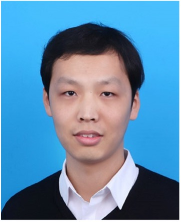

**报告摘要**: 保证大规模软件的绝对正确性，是信息化社会可靠运行的基石，也是软件工程的“圣杯”级梦想。形式化证明凭借其数学意义上的严密性，是通向这一梦想的有效途径。然而，其极高的人力成本却成为横亘在理想与现实之间一道难以逾越的鸿沟。本报告将介绍基于神经符号融合的定理证明自动化技术相关进展，包括数学领域的不等式证明与软件领域的seL4定理证明，并探讨大模型时代AI在软件开发领域的应用与潜力。

**报告人简介**: 姚远，南京大学计算机学院副教授、博士生导师。长期从事软件智能化技术研究，近年来尤其关注软件形式验证技术。在中国科学：信息科学、OSDI、ICSE、FSE、ISSTA、ASE、CCS、S&P、ICLR、NeurIPS、AAAI、IJCAI等软件智能化相关领域的国内外重要期刊与会议上发表论文百余篇，工作曾获ACM 杰出论文奖等奖励，并受到了业内权威媒体MIT Technology Review报道。

<!--more-->
