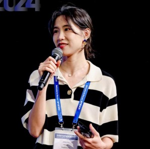

**报告题目**: From Informal to Formal – Incorporating and Evaluating LLMs on Natural Language Description to Verifiable Formal Proofs

**报告摘要**: The research in AI-based formal mathematical reasoning has shown an unstoppable growth trend. These studies have excelled in mathematical competitions like IMO and have made significant progress. This paper focuses on formal verification, an immediate application scenario of formal reasoning, and breaks it down into sub-tasks. We constructed 18k high-quality instruction-response pairs across five formal specification languages (Coq, Lean4, Dafny, ACSL, and TLA+) by distilling gpt-4o and evaluated against ten open-sourced LLMs, including recent popular DeepSeek-R1. We also fine-tuned several 7~8B small models to achieve comparable performance with Deepseek-R1-671B. Interestingly, we observed that fine-tuning with formal data also enhances mathematics, reasoning, and coding capabilities.

**报告人简介**: Dr. Jialun Cao is a Research Assistant Professor at the Hong Kong University of Science and Technology. Her main research areas include AI testing, AI4SE, and AI4formal verification, etc. She received her Ph.D. from the Hong Kong University of Science and Technology under the supervision of Professor Shing-Chi Cheung. She has published more than 20 papers in ICSE, ESEC/FSE, CAV, ASE, USENIX Security, TOSEM. She serves as a program committee member of top-tier conferences including ICSE, FSE and ASE. She received the 2025 ACM SIGSOFT Outstanding Dissertation Award.
